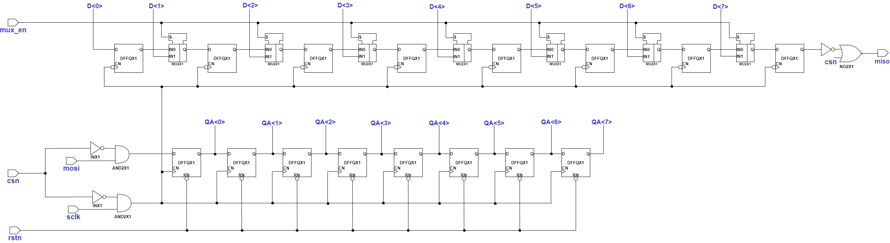
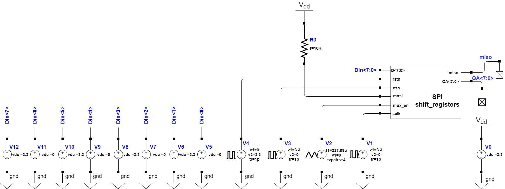
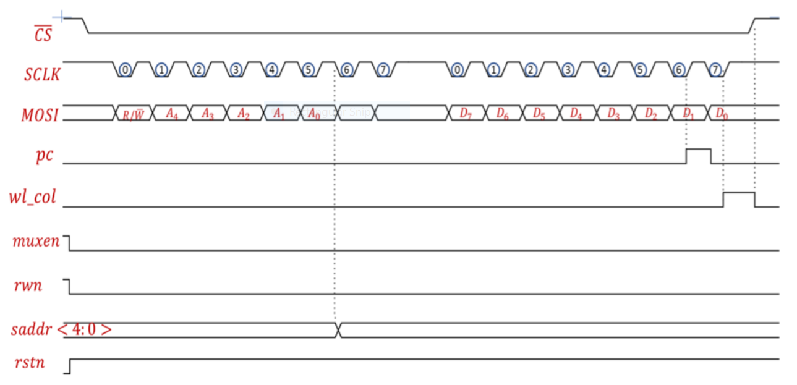
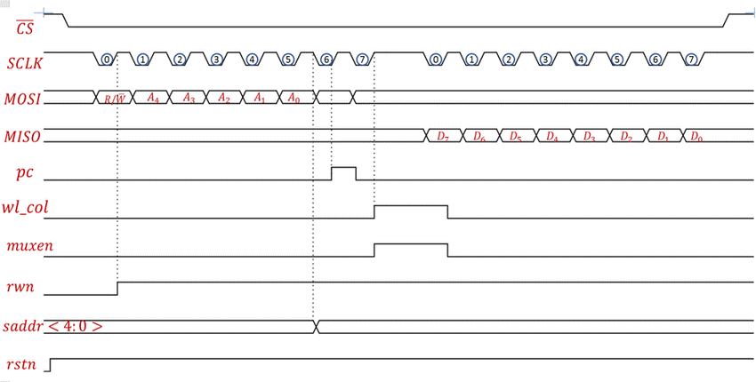
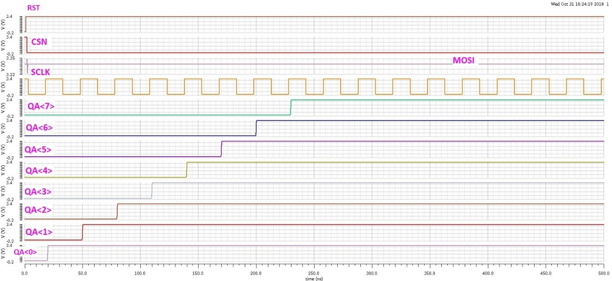
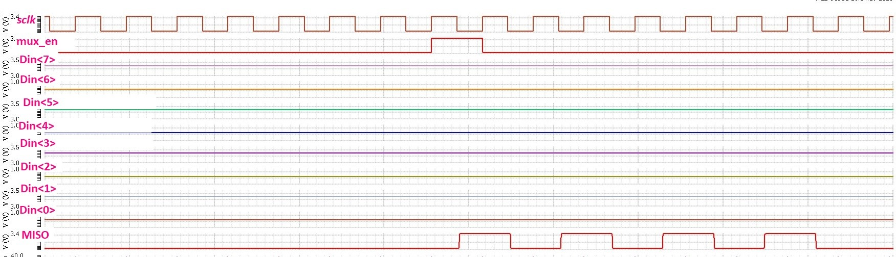

# Design and Interfacing of Serial Peripheral Interface (SPI) with SRAM Array in 0.6um CMOS

## Abstract
This project report provides details on the semi-custom design of SPI Interface with SRAM Array for IOT based embedded system implemented in a 0.6μm CMOS technology. The SPI Interface which aids in the write and read operations from a (16 x 16) bit SRAM was designed, simulated, layout done and tested successfully using Cadence and Spectre. The innovation of this project lies in creating and controlling all the signals required for the SRAM without use of internal clocks, deriving all control signals from the SPI signals themselves instead, thereby making it a simple and scalable circuit that can be made to consume very little power with slower access time.

## Introduction
Serial Peripheral Interface or SPI is a synchronous serial communication protocol that provides full – duplex communication at very high speeds. It is a master – slave type protocol that provides a simple and low-cost interface between a microcontroller and its peripherals. It has a single master and can have one or multiple slaves.   

A common serial port is called ‘asynchronous’ because the data sent and received are not synced with each other hence leading to some discrepancies. Therefore, asynchronous serial connections add extra start and stop bits to each byte as well as the transmission speed is set to help the receiver sync up to data as it arrives. These extra bits require lot of overhead and also contribute to complex hardware. On the other hand, SPI is a ‘synchronous’ data bus which uses separate lines for data and a clock that helps for perfect sync between both sides.  

SPI is called a four-wire serial bus consisting of four signals/pins: -
 - MOSI(Master Out Slave In) - Data flows from master to slave through it.
 - MISO(Master In Slave Out) - Data flows from slave to master through it.
 - SCLK(Synchronous Clock) - Generated from the master to make clock synchronous with data signals of the slave.
 - CS/SS(Chip Select/Slave Select) – Signal to select a particular slave used by master for communication.  
 
The master controls the clock frequency, polarity and phase w.r.t. data. The CPOL bit sets the polarity of the clock signal during the idle state. The CPHA bit selects the clock phase. Depending on the CPHA bit, the rising or falling clock edge is used to sample and/or shift the data. A master-slave pair must use the same set of parameters: SCLK frequency, CPOL, and CPHA for an effective communication. Depending on the CPOL and CPHA bit selection, four SPI modes are available as shown in Table I. Out of the four modes, mode 3 is implemented in this project. 

|  SPI Modes |	CPOL | CPHA | Idle Clock  |	Data Rx/Tx from Master        |
|:------------------:|:---------------:|:---------------:|:---------------:|:---------------:|
| 0  | 0  | 0  | Low | Rising Edge Sample, Falling Edge Data | 
| 1  | 0  | 1  | Low | Falling Edge Sample, Rising Edge Data |
| 2  | 1  | 1  | High | Falling Edge Sample, Rising Edge Data |
| 3  | 1  | 0  | High | Rising Edge Sample, Falling Edge Data |

Table 1: SPI Modes

## Circuit Design

SPI schematic consists of 16- bit shift registers as shown in figure 1. These shift registers are basically D-FF (D-Flip Flops) connected one after another providing the function of shift registers as a whole. The components that have been used here are given below along with their purposes-

||  
|:--:| 
|*Figure 1: SPI Architecture*|

### Components

1) CSN (Chip Select Line) - It is an active low signal represented as CS bar generated by the master block of SPI signal. Whenever it is low, only then the slave of SPI functions. 
2) MOSI (Master Out Slave In) - Serially, data is transferred from the master to the slave. This acts as the input to the 1st D FF and hence each bit is shifted by the shift register in each clock cycle.
3) MISO (Master In Slave Out) - The data is serially transferred from the slave to the master. This acts as the output from the last D-FF. Each bit is shifted and is obtained as output one by one.
4) SCLK (Synchronous Clock) - This signal is also generated by the master and sent to the slave. Depending on the positive and negative edge triggered flip-flop, the data is shifted accordingly. The signals also are activated or deactivated depending on each clock pulse.
5) MUXEN (MUX Enable) - This signal is used for enabling the MUX 2:1. When it is 0, input I0 of the MUX is selected. On the other hand, when it is 1, input I1 of the MUX is selected. It is used in the read operation.
6) RST (Reset) - This is a signal used to set the Flip-Flops to their predetermined state, either by the device itself or externally whenever required. The reset used here is an active high reset signal.
7) GATES- Here, two types of gates, each two in number are used. Inverters are used to make the chip select line active low. AND gates are used too.
8) DFFs- Two types of D-FFs are used.
    -  DFRRQX1- D-FF with reset signal and positive edge triggered. 8 of these are used.
    -  DFFQX1- D-FF with negative edge triggered and no reset. 8 of these are used.
9) 2:1 MUX- Seven MUXes are used mainly for read operation. It transfers either of the two inputs I0 and I1 depending on the MUXEN signal and provides the output which is input to the flip-flops.
10) D<7:0> - These are 8-bit data lines (D0, D1, D2, D3, D4, D5, D6, D7) that are parallel inputs to the flip-flops through MUX. They come from the SRAM cell during READ operation.
11) QA<7:0> - These are 8-bit output lines (QA0, QA1, QA2, QA3, QA4, QA5, QA6, QA7) from DFRRQX1. These are used in WRITE operation for writing 8-bit into the SRAM cell.

### Working

The CSN is first inverted to make it active low signal. This signal is then ANDed with MOSI and SCLK separately.  Being ANDed, it ensures that whenever the CS signal is active low, only then the input and the clock which are fed to the D-FF are valid. When the CS signal is active high, though CLK and MOSI may be functioning, the inputs to the D-FF are not working. The main purpose of ANDing is ensuring unnecessary clock pulses and inputs to be shifted thus providing a dynamic structure.  

The first 8 FFs are DFRRQX1 with positive edge triggered clock and reset signal along with the input. These are connected in such a way to make it function like a SIPO shift register. In SIPO shift register, data is serially being fed to the first FF, which is then getting shifted in each clock pulse to the next FF. In each clock pulse, 8-bit parallel output (QA<7:0>) is obtained. The next 8 FFs are DFFQX1 with negative edge triggered clock and no reset signal. The connections are so designed to make it as a PISO shift register. Data is fed in a parallel manner to the 8-bit shift registers which takes a single clock pulse. The serial output – MISO is obtained hence from subsequent clock pulses.  

The whole circuit along with the pins and signals are now ready to be molded into a symbol. The symbol is created hence and this symbol can be accessed in our test bench used for further verifying the results. The figure-2 shows the symbol of SPI schematic.

||  
|:--:| 
|*Figure 2: SPI Testbench*|

### Write Operation

For writing data or address to the SRAM cell, we use the first 8 FFs which are DFRRQX1. Firstly, we need the address of the cell to which the 8-bit data will be written provided by the master through MOSI. After the master (e.g. the microcontroller) selects the SRAM chip by pulling CS low, 2 bytes(words) are transferred serially on the Master-Out-Slave-In (MOSI) port with data changing synchronously every negative edge of the clock input (SCLK).    The first bit of the first word is assigned to denote if the operation is read (1) or write (0). The next 5 bits are assigned for the address of the SRAM and the last two bits are unused. The second byte(word) is assigned the 8-bit data that needs to be written to the corresponding address. The controller latches the read/write bit after the first clock cycle and latches the address to the decoders at the end of the 6th clock cycle. Then the controller generates a pre-charge signal (pc) at the positive edge of the 14th cycle for one clock period. The data is latched for write at the positive edge of the last clock cycle (16th) and write control signals (wl, wr, col) are also asserted at the same edge and pulled low when the chip is de-selected (CS is high). When the wordline is high, the SRAM cell is activated and data is stored in that particular clock pulse. When the wl goes low, the data gets latched or is said to be written onto the cell. The col is a used as a signal that functions like a column decoder to select the column address. The wr signal is write enable signal, when it goes high only then the write operation is performed.

||  
|:--:| 
|*Figure 3: Timing Diagram for Write Operation*|

### Read Operation

The master sends the address of the SRAM cell from which the 8-bit data has to be accessed and read by using the MISO signal(serial output from the last FF). First byte of the read operation is the same as the write operation except, the pre-charge signal is asserted at the positive edge of the 7th clock cycle and the read control signals (wl, muxen, sae, col) are asserted from one clock cycle at the positive edge of the 8th clock cycle which starts the read process and the data is latched by a shift-register at the negative edge of the 9th clock cycle. Once the data is latched, the shift registers shift each bit into the Master-Input-Slave-Output (MISO) port at the negative edge of the clock for the next 8 clock cycles. The first 5-bit address is written to the SRAM cell and the corresponding cell is selected. This is done using the first 8 FFs- DFRRQX1. Now, the read operation has to start. So the precharge signal is made high before the read starts so as to ensure the read is performed in the SRAM cell accurately. The wl is made high so that we can access the data from the bl line. The muxen signal is made high. This selects the parallel data input to the FFs. 8 DFFQX1 are used here. Hence, the data is read serially in each clock pulse. And at the end of 16 clock pulses, we obtain the MISO data. When the address is sent to the SRAM cell, the first 8 FFs are working for the first 8 clock cycles. During that time, the MUXen signal is low and hence I0 is selected and its output is input to the FFs- DFFQX1. So the MISO signal is low for the 1st 8 clock cycles. During the next 8 clock cycles, the data is being read. Hence, when the MUXen is high, the input I1 is selected and the parallel data is loaded to the FFs. In these next 8 clock cycles, the data is being read serially.

||  
|:--:| 
|*Figure 4: Timing Diagram for Read Operation*|

## Circuit Simulation

The testbench was simulated using Spectre for both write and read operations.

### Write Operation

The RSN signal is set from low to high and CSN signal from high to low. MOSI is permanently set to 1. In the 1st clock cycle, Q0 is 1 and rest 7 output lines are 0. In the next cycle, Q0 and Q1 are 1 and rest are 0. Similarly, in each clock pulse, 1 bit shifting occurs. Hence, at the end of 8 clock pulses, 5-bit address is written to the SRAM cell. In the next 8 cycles, 8-bit data is transferred to the SRAM cell in similar manner. The MOSI input is 1 1 1 1 1 1 1 1. We observe from the figure that after the 8th positive edge of clock pulse, the sequence Q0 to Q7 is 1 1 1 1 1 1 1 1.

||  
|:--:| 
|*Figure 5: Simulation Results for Write Operation*|

### Read Operation

The 8-bit data is parallely given as input to the last 8 FFs when the MUXen is high. During the first 8 clock pulses, the address from which read operation has to be performed is given as input from the MOSI. Hence, we can observe that during these cycles, MISO is 0 as the MUXen is low and there is no parallel input to last byte of FFs. As the MUXen goes high, the parallel data is loaded onto the FFs and then the data to be read is serially received as output from MISO. As we observe from the figure, the data sent in the sequence D7 to D0 – 1 0 1 0 1 0 1 0. The MISO output from the 9th to 16th negative edge clock pulse is also 1 0 1 0 1 0 1 0.

||  
|:--:| 
|*Figure 6: Simulation Results for Read Operation*|

## Layout Design

The layout of the circuit as shown in Figure IV.1 was designed using the Cadence Virtuoso Layout Editor. The connections were carefully done by using “metal-2” for vertical and “metal-1” for horizontal connections. The dimension of our layout is 379.15um * 65.75um. The layout design was then made to go through three types of testing procedures using Cadence Assura i.e.
i. Design Rule Checking (DRC)
ii. Layout v/s Schematic (LVS)
iii. Electronic Rule Checking (ERC)

||  
|:--:| 
|*Figure 7: Layout Design for SPI*|

## Conclusion 

In this project, we successfully designed the schematic of a circuit which implemented SPI protocol for circuit communication in the I2C/SPI compatible low power SRAM which is suitable for IOT and embedded system-based operations. Using the Cadence Virtuoso and Cadence Assura design tools, we were able to Test and verify the timing diagrams and layout connections of the same. The fast mode of SPI having a 3.3MHz clock was implemented with a single master and single slave having a 5-bit address and can be able to process 8-bit data as well as 16-bit data, both the read and write operations were executed successfully.

## Acknowledgement

We would like to thank our institution for equipping us with Advanced VLSI Lab facilities to successfully execute our project. We are also grateful to our mentor, Dr. Saroj Rout (linkedin.com/in/sroutk) for his constant advice and guidance throughout the project duration.

## References

[1] Kang S., Leblebici Y., “CMOS Digital Integrated Circuits: Analysis and Design”, 2nd Ed., 2003  
[2] Hodges and Jackson, “Chapter-8: Semiconductor Memory Design”, 3rd Ed, McGraw-Hill, 2003  
[3] A. Pavlov, “CMOS SRAM” – Chapter-2, Springer, 2008  
[4] N. H. E. Weste, D. Harris, A. Banerjee, “CMOS VLSI Design”, Pearson, 2016  
[5] J. Baker, “Chapter-16: Memory Circuits”, Wiley, 2008  
[6] Frederic Leens, "An introduction to SPI and I2C protocol," IEEE Instrumentation and Measurement magazine, February 2009.  
[7] Jianlong Zhang, Jiwei Wang, Chunyu Wu, Wenjing Zhang, "The design and realization of a comprehensive SPI interface controller," Second International Conference on Mechanic Automation and Control Engineering (MACE), 2011 IEEE.  
[8] Motorola Inc., "SPI Block Guide V03.06," March 2003.  
[9] Anand N, George Joseph, Suwin Sam Oommen, R Dhanabal, "Design and implementation of a high speed Serial Peripheral Interface", Advances in Electrical Engineering (ICAEE) 2014 International Conference on, pp. 1-3, 2014.  
[10] Lattice Semiconductor Inc., "SPI Slave Controller V 01.0," October 2012.  

